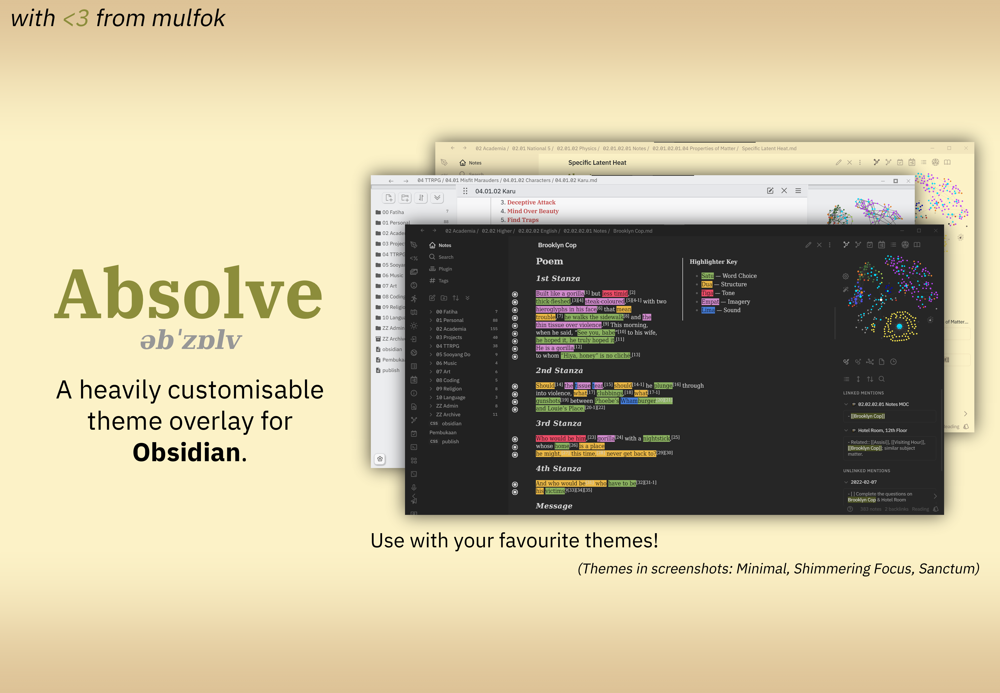
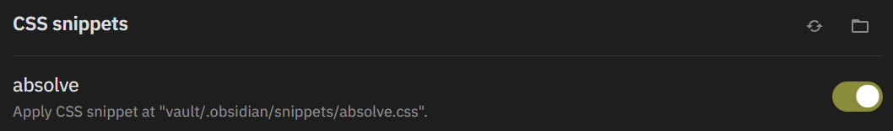

_əbˈzɒlv_

# Absolve

A customisable theme overlay snippet for **Obsidian.md**.

_Absolve_ is a snippet designed to overlay your current theme and add features, preferences, and various fixes. With good support for both mobile desktop _and_ Publish, you'll find that the sky's the limit with making your favourite theme **perfect for you**.

**Table of Contents:**

1. [Setup](#Setup)
2. [Features](#Features)
   1. [Aesthetics](#Aesthetics)
   2. [Design Schemes](#Design%20Schemes)
   3. [External Theme Features](#External%20Theme%20Features)
   4. [Highlighter](#Highlighter)
   5. [Kanban](#Kanban)
   6. [Tweaks](#Tweaks)
   7. [Typography](#Typography)
3. [Checklist](#Checklist)

---

### Setup

Setting up Absolve is simple! First off, make sure you have the following plugins installed:

- [Style Settings](https://github.com/mgmeyers/obsidian-style-settings)

Once you have the plugins required, go the _releases_ page of this repo and download `absolve.css`. Once downloaded, go to your vault’s directory. Then, navigate to `.obsidian/snippets`, and place `absolve.css` in the folder.

Once that’s done, go to the settings pane in Obsidian. Navigate to Appearance, CSS Snippets, and then click the reload button. Absolve should appear, and then you can turn it on.

Your setup is complete! To make use of Absolve’s [features](#Features), just go into your Style Settings menu, and tweak what you like. Have fun!

### Features

#### Aesthetics

#### Design Schemes

#### External Theme Features

#### Highlighter

#### Kanban

#### Tweaks

#### Typography

### Checklist

- [ ] Aesthetics
  - [ ] Caret
    - [ ] Fill Colour
    - [ ] Outline Colour (Transparent for none)
    - [ ] Caret Style
      - [ ] Block
      - [ ] Pipe (Default)
  - [ ] Colours
    - [x] Accents ✅ 2022-02-11
      - [x] Text ✅ 2022-02-09
      - [x] Text Hover ✅ 2022-02-09
      - [x] Interactive ✅ 2022-02-09
      - [x] Interactive Hover ✅ 2022-02-09
    - [ ] Workspace
      - [x] Light Mode Colour Schemes ✅ 2022-02-11
        - [x] Notepad ✅ 2022-02-11
      - [ ] Dark Mode Colour Schemes
      - [ ] File Navigation
- [x] Design Schemes ✅ 2022-02-09
  - [x] Academia ✅ 2022-02-09
  - [x] TTRPG ✅ 2022-02-09
  - [x] Viridian ✅ 2022-02-09
- [ ] External Theme Features
  - [ ] Minimal Theme
    - [x] Toggle Checkboxes ✅ 2022-02-12
      - [ ] Checkbox Shape
  - [x] Sanctum ✅ 2022-02-11
    - [x] Toggle Aside Tags ✅ 2022-02-11
  - [ ] Shimmering Focus
    - [x] Toggle Footnote Indicators ✅ 2022-02-11
    - [ ] Toggle Unresolved Link Indicators
- [x] Highlighter ✅ 2022-02-12
- [x] mulfok-style Kanban ✅ 2022-02-12
- [x] Tweaks ✅ 2022-02-10
  - [x] Toggle Compact Admonitions ✅ 2022-02-09
  - [x] Toggle Rainbell’s Column Admonitions ✅ 2022-02-09
  - [x] Toggle Image Desaturation ✅ 2022-02-10
  - [x] Toggle No Nonsense Note Embeds ✅ 2022-02-11
- [x] Typography ✅ 2022-02-11
  - [x] Font Preferences ✅ 2022-02-09
    - [x] Preview Mode Font ✅ 2022-02-09
    - [x] Edit Mode Font ✅ 2022-02-09
    - [x] Header Font ✅ 2022-02-09
    - [x] Accent Font ✅ 2022-02-09
    - [x] User Interface Font ✅ 2022-02-09
  - [x] Font Sizes ✅ 2022-02-11
    - [x] File Navigation Font Size ✅ 2022-02-09
  - [x] Font Feature Settings ✅ 2022-02-09
    - [x] Toggle Ligatures ✅ 2022-02-09
    - [x] Toggle Slashed Zeroes ✅ 2022-02-09
    - [x] Toggle Alternate Glyphs ✅ 2022-02-09
  - [x] Headers ✅ 2022-02-11
    - [x] Header Colours ✅ 2022-02-11
    - [x] H1 Toggle: Italics, Text Transform, Font Variant; Change: Size, Align ✅ 2022-02-11
    - [x] H2 Toggle: Italics, Text Transform, Font Variant; Change: Size, Align ✅ 2022-02-11
    - [x] H3 Toggle: Italics, Text Transform, Font Variant; Change: Size, Align ✅ 2022-02-11
    - [x] H4 Toggle: Italics, Text Transform, Font Variant; Change: Size, Align ✅ 2022-02-11
    - [x] H5 Toggle: Italics, Text Transform, Font Variant; Change: Size, Align ✅ 2022-02-11
    - [x] H6 Toggle: Italics, Text Transform, Font Variant; Change: Size, Align ✅ 2022-02-11
  - [x] Links ✅ 2022-02-10
    - [x] Toggle External Links Icon ✅ 2022-02-10
    - [x] Toggle Underline External Links ✅ 2022-02-10
    - [x] Toggle Underline Internal Links ✅ 2022-02-10
